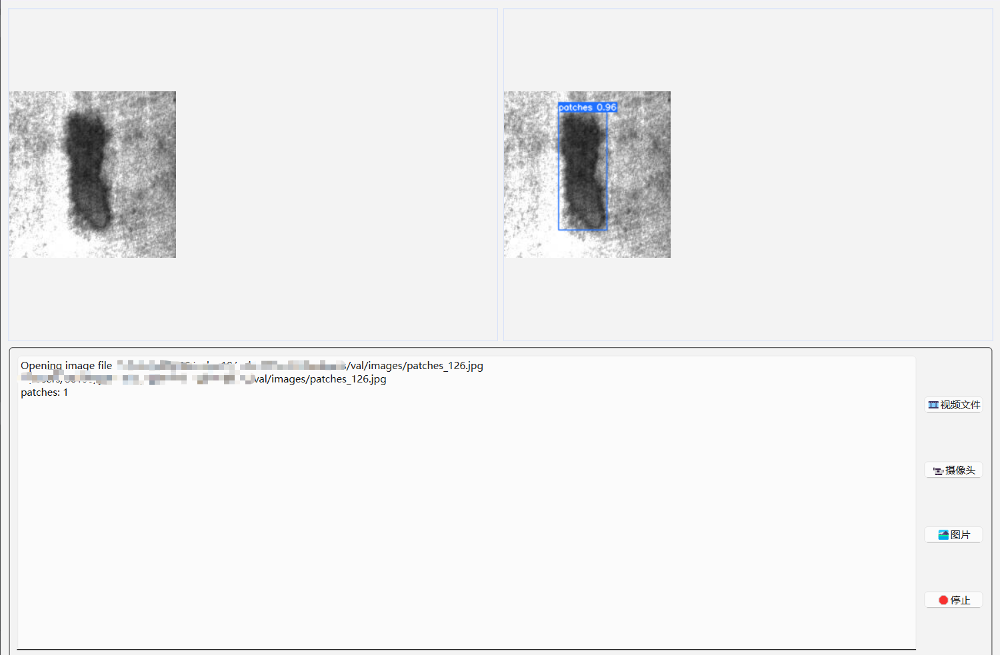
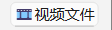
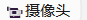
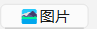
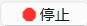
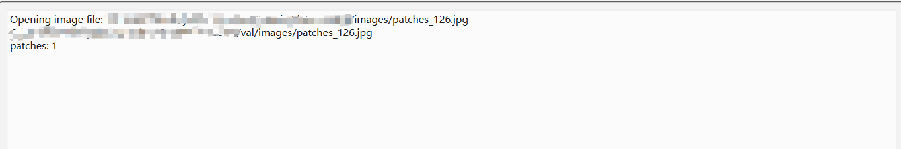

# [Surface-defect-recognition-algorithm-based-on-YOLOv10]

## Project Overview
This project focuses on developing an advanced surface defect detection system using the YOLOv10 object detection algorithm. The primary objective is to detect surface defects in industrial materials, specifically strip steel, with high accuracy and efficiency.

## Key Components
### 1. YOLOv10 Training
#### Algorithm: YOLOv10, a state-of-the-art object detection model, is trained to identify and classify various types of surface defects.
####  Data: The training dataset consists of labeled images representing different defect types on strip steel surfaces.
####  Outcome: The trained model is capable of real-time detection, providing precise localization and classification of surface defects.

### 2. UI Design with PyQt
#### Interface: A user-friendly graphical user interface (GUI) is designed using PyQt to enhance the visualization of detection results.
#### Features: The interface allows users to upload test images, view real-time detection results, and interact with the model's parameters.
#### Visualization: The UI displays both the input images and the detected defects, making it accessible for operators in industrial settings.

### 3. Dynamic Video Simulation with OpenCV
#### Video Synthesis: OpenCV is utilized to combine the test images into a dynamic video sequence. This simulates the real-time detection process in a strip steel production environment.
#### Simulation: The video output provides a realistic representation of how the detection system would perform during actual steel production, ensuring that the system meets industrial requirements.

## YOLOv10

[YOLOv10: Real-Time End-to-End Object Detection](https://arxiv.org/abs/2405.14458).\
Ao Wang, Hui Chen, Lihao Liu, Kai Chen, Zijia Lin, Jungong Han, and Guiguang Ding\
          

Please refer to the specific code of YOLOv10："https://github.com/THU-MIG/yolov10"

## UI Design with PyQt
The UI is divided into two main sections. The upper section features a visualization window, where the left side displays the original image and the right side shows the detection results after processing by the model. The lower section consists of four functional buttons and a log output window. The log window provides real-time updates on the current detection information. The four buttons include an **Image Detection** button for processing selected images, a **Video Detection** button for video analysis, a  Camera Detection button for live feed analysis, and a **Stop** button to halt the detection process.

  
  UI interface diagram

### Button
The Image Detection button allows users to select and analyze a single image for surface defects. The Video Detection button enables the processing of a video file, detecting and highlighting defects frame by frame. The Real-time Camera Detection button initiates live feed analysis from a connected camera, providing real-time detection results. The Stop button is designed to halt any ongoing detection process, offering users control over the detection workflow.

  
  The Video Detection button

  
  The Real-time Camera Detection button

  
  The Image Detection button

  
   The Stop button

### Log window
The log window provides real-time feedback by displaying detailed information about each detection operation, including timestamps, detected defect types, and processing status. This feature helps users monitor the system's performance and review the results of each detection task.

  
   The Stop button

## Conclusion
This project not only advances the detection capabilities for surface defects but also integrates a high-level visual interface and realistic simulation to ensure practical applicability in industrial environments. The combination of YOLOv10, PyQt, and OpenCV offers a comprehensive solution for surface defect detection, paving the way for more efficient and accurate quality control processes in the steel industry.